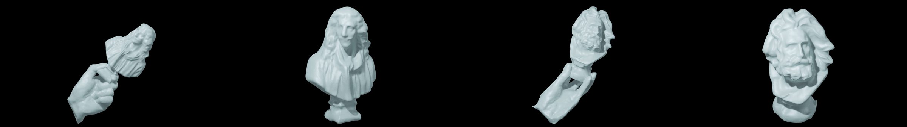

# Reconstructing Hand-Held Objects from Monocular Video
### [Project Page](https://dihuangdh.github.io/hhor/) | [Video](https://youtu.be/Xfkm7HP9OQA) | [Paper](https://arxiv.org/abs/2211.16835) | [Data](https://unisydneyedu-my.sharepoint.com/:f:/g/personal/dhua9550_uni_sydney_edu_au/EnAhi57D41JJrxwMMRtMXsABMtJ4KAJ8qTuZkpdiDCON5A?e=mhKzbV)
<br/>



> [Reconstructing Hand-Held Objects from Monocular Video](https://arxiv.org/abs/2211.16835)  
> Di Huang, Xiaopeng Ji, Xingyi He, Jiaming Sun, Tong He, Qing Shuai, Wanli Ouyang, Xiaowei Zhou  
> Siggraph Asia 2022 Conference Track

## TODO List
- [x] Release the minimal runnable code.
- [ ] Release the hand tracking code.
- [x] Release the dense reconstruction code.
- [x] Release the dataset.
> Note: The hand tracking code will be released with the [EasyMocap](https://github.com/zju3dv/EasyMocap) repo.

## Installation
### Set up environment
```bash
conda create -n hhorv1 python=3.7

# PyTorch
conda install pytorch==1.8.0 torchvision==0.9.0 torchaudio==0.8.0 cudatoolkit=10.2 -c pytorch

# requirements
pip install -r requirements.txt
```

### Install 3rd party libraries
We use the following 3rd party libraries and directly add their code to this repo([NanoDet](https://github.com/RangiLyu/nanodet), [EasyMocap](https://github.com/zju3dv/EasyMocap), [BackgroundMattingV2](https://github.com/PeterL1n/BackgroundMattingV2), [MMSegmentation](https://github.com/open-mmlab/mmsegmentation)). Our dense reconstruction code is built upon [NeuS](https://github.com/Totoro97/NeuS).
Thanks for their great work and we appreciate their contribution to the community. Please follow their installation instructions and LICENSE.
```
# NanoDet (for detection during hand tracking)
cd nanodet
python setup.py develop --user

# EasyMocap (for hand tracking)
cd EasyMocap
python setup.py develop --user

# Background Matting (for foreground segmentation)

# MMSegmentation (for hand segmentation)
cd mmsegmentation
pip install mmcv-full==1.4.0
python setup.py develop --user
```

### Download pretrained models
* Download the pretrained hand segmentation model [here](https://unisydneyedu-my.sharepoint.com/:u:/g/personal/dhua9550_uni_sydney_edu_au/EdxqHCaRAZlAuakxx46K2KwBWrp0v7KkHPw6cu3zXag5-w?e=Sr98Sw) and unzip to `mmsegmentation/work_dirs`.
* Download the pretrained hand detection model [here](https://unisydneyedu-my.sharepoint.com/:u:/g/personal/dhua9550_uni_sydney_edu_au/EWvwlGxAm8BMk8WKeg3CSkoBItld3SeSQ_Govj34m_w30w?e=nA4Yn5) and unzip it to `nanodet/data`.

## Running
### Download demo data
* Download the demo data [here](https://unisydneyedu-my.sharepoint.com/:u:/g/personal/dhua9550_uni_sydney_edu_au/EbI1zCfR8nBDkWpf-VAmoqUBuGOnhvqObD0xSyUd5XhIQA?e=4Nsx7S) and unzip to `data/DEMO`.

### Run reconstruction
```bash
# Edit 0_set_path.sh
vim apps/0_set_path.sh

# Prepare video to images (done in the demo data)
# sh apps/1_video_to_imgs.sh

# Run hand tracking (done in the demo data)
# sh apps/2_run_easymocap.sh

# Run mask generation
sh apps/3_background_matting.sh

# Generate camera poses by MANO
sh apps/4_get_mano_camera.sh

# Run hand segmentation
sh apps/5_run_segmentation.sh

# Dense reconstruction 
cd NeuS
vim confs/demo/hand_scanner_wmask_wbarf_wsem_warp10.0_mask5_demo.conf  # Edit the path to the demo data
CUDA_VISIBLE_DEVICES=0 python exp_runner.py --mode train --conf ./confs/demo/hand_scanner_wmask_wbarf_wsem_warp10.0_mask5_demo.conf --case demo
CUDA_VISIBLE_DEVICES=0 python exp_runner.py --mode validate_mesh --conf ./confs/demo/hand_scanner_wmask_wbarf_wsem_warp10.0_mask5_demo.conf --case demo --is_continue
```

After running the above commands, you can find the reconstructed mesh in `NeuS/exp/demo/handscanner/meshes/00100000_org.ply` and `NeuS/exp/demo/handscanner/meshes/00100000_obj.ply`. The `*_org.ply` is the reconstructed mesh with the hand and the `*_obj.ply` is the reconstructed mesh without the hand. For `00100000_obj.ply`, you can use MeshLab to remove the useless parts (e.g., the remaining hand) and complete the hole with Poisson reconstruction.

## Dataset
* [HOD_S1](https://unisydneyedu-my.sharepoint.com/:u:/g/personal/dhua9550_uni_sydney_edu_au/EaE4g4lZBE9Flk-aqMkl8nQBImzSkUASG1oESR3QeK8WGw?e=Pd4WNv) is the main dataset used in the paper, which contains hand-held objects with fixed grasping poses.
* [HOD_S2](https://unisydneyedu-my.sharepoint.com/:u:/g/personal/dhua9550_uni_sydney_edu_au/EU3zQUW5fGRMpFlswjoKOg8BiIeCkqqMY6p5sZjVadfbmw?e=QOVQCe) and [HOD_D1](https://unisydneyedu-my.sharepoint.com/:u:/g/personal/dhua9550_uni_sydney_edu_au/Ed6hlU_yrT9NoC9yktqOKZ4BWzpQsEPhDBx-V4tLwtNHLg?e=ZCyiBe) are the datasets for future hand-held object reconstruction research. HOD_S2 has hand-held objects with different fixed grasping poses than HOD_S1. HOD_D1 has hand-held objects with dynamic graspings. Check our paper for more details.

## Citation
```
@inproceedings{huang2022hhor,
  title={Reconstructing Hand-Held Objects from Monocular Video},
  author={Huang, Di and Ji, Xiaopeng and He, Xingyi and Sun, Jiaming and He, Tong and Shuai, Qing and Ouyang, Wanli and Zhou, Xiaowei},
  booktitle={SIGGRAPH Asia Conference Proceedings},
  year={2022},
}
```